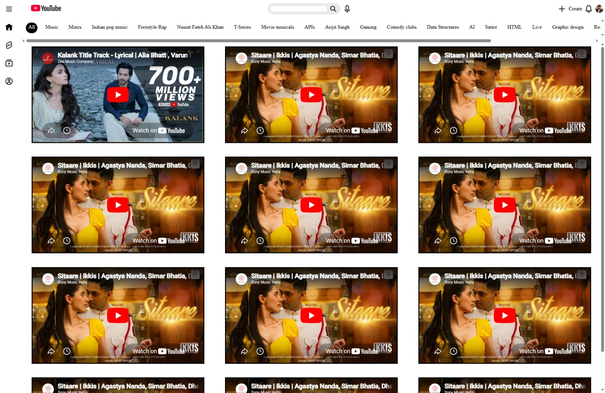
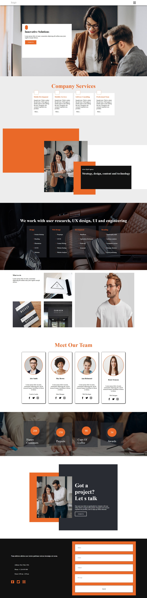

# Upgrad Projects

| Assignment No | Name | Source Code | Image |
|---|---|---|---|
| 03 | Space | [Project03](https://github.com/it-Shoeb/Upgrad---Learning-Center/tree/main/Frontend/Project03) |  |
| 02 | Youtube Clone | [Project02](https://github.com/it-Shoeb/Upgrad---Learning-Center/tree/main/Frontend/Project02) |  |
| 01 | First Project | [Project01](https://github.com/it-Shoeb/Upgrad---Learning-Center/tree/main/Frontend/Project01) |  |